[English](./README.en.md) · [Website](https://riskshape.lei6393.com) · [GitHub](https://github.com/SuperMarioYL/riskshape)

<picture>
  <source media="(max-width: 600px) and (prefers-color-scheme: dark)" srcset="./assets/presentation/hero-mobile-dark.svg">
  <source media="(max-width: 600px)" srcset="./assets/presentation/hero-mobile-light.svg">
  <source media="(prefers-color-scheme: dark)" srcset="./assets/presentation/hero-dark.svg">
  
</picture>

# RiskShape

**为重复 Agent 操作复用明确决策**

RiskShape 将工具调用归一化为操作形状，查询 SQLite 中的 safe/unsafe 标签，再按配置阈值返回 auto_approve 或 escalate。

## 为什么需要它

如果每次权限决策都从头开始，重复提示就无法利用历史上下文。本地账本让此前标签可见，但只用于同一归一化操作形状；新形状和标签不足的形状仍需审阅。

- **查看历史依据** — 评分列出 safe/unsafe 次数及决策原因。
- **保留样本门槛** — 达到 min_samples 前，仅有较高标签比例不会自动批准。
- **特权范围仍需确认** — 识别出的破坏性、特权 Shell 和管道转 Shell 范围始终升级确认。

## 架构

<picture>
  <source media="(max-width: 600px) and (prefers-color-scheme: dark)" srcset="./assets/presentation/architecture-mobile-dark.svg">
  <source media="(max-width: 600px)" srcset="./assets/presentation/architecture-mobile-light.svg">
  <source media="(prefers-color-scheme: dark)" srcset="./assets/presentation/architecture-dark.svg">
  
</picture>

shape.py 根据工具名和输入生成稳定签名与能力范围。Ledger 记录标签并汇总次数，Grader 依次检查已识别特权范围、是否见过、样本数量和 safe 标签比例。Hook 和 MCP 接口复用此评分器，不维护另一套规则。

| 组件 | 职责 |
| --- | --- |
| `Tool input` | name and arguments |
| `Normalizer` | signature and derived scope |
| `SQLite ledger` | explicit outcome labels |
| `Grader` | threshold and escalation |
| `Hook / MCP` | decision and explanation |

## 安装与快速上手

支持 Python 3.10+；此源码示例使用 Python 3.12 虚拟环境与 uv。

```bash
git clone https://github.com/SuperMarioYL/riskshape.git
cd riskshape
uv venv --python 3.12
source .venv/bin/activate
uv pip install -e .
```

脚本使用新的临时 SQLite 账本、固定 tau/min_samples 和明确的合成标签。只把 make build、sudo make build 当作字符串评分，不运行命令或安装 Hook。

```bash
.venv/bin/python examples/presentation_demo.py
```

## 实际运行示例

<picture>
  <source media="(max-width: 600px) and (prefers-color-scheme: dark)" srcset="./assets/presentation/process-mobile-dark.svg">
  <source media="(max-width: 600px)" srcset="./assets/presentation/process-mobile-light.svg">
  <source media="(prefers-color-scheme: dark)" srcset="./assets/presentation/process-dark.svg">
  
</picture>

Three safe labels approve the demo shape; one unsafe label returns it to escalation at tau=0.85.

```text
{"stage": "unseen", "shape": "make build", "scope": "build-install", "safe": 0, "unsafe": 0, "decision": "escalate"}
{"stage": "three safe labels", "shape": "make build", "scope": "build-install", "safe": 3, "unsafe": 0, "decision": "auto_approve"}
{"stage": "one unsafe label added", "shape": "make build", "scope": "build-install", "safe": 3, "unsafe": 1, "decision": "escalate"}
{"stage": "privileged despite labels", "shape": "sudo make build", "scope": "shell-privileged", "safe": 3, "unsafe": 0, "decision": "escalate"}
Scope: empirical label arithmetic; no commands executed or approval hooks installed.
```

完整命令与输出保存在 [docs/demo-results.json](./docs/demo-results.json). 输入和复现代码均随仓提供。

## 用法

grade 解释一个归一化形状，ledger 列出标签和决策。record --tool Bash "make build" safe 向所选数据库添加操作员标签。converge 在隔离数据库中回放语料，默认语料为合成数据。hook-snippet 打印供检查的接入配置，riskshape mcp serve 提供本地 MCP 接口。

```bash
.venv/bin/riskshape grade --tool Bash "make build"
.venv/bin/riskshape ledger
.venv/bin/riskshape converge --json
.venv/bin/riskshape hook-snippet
```

## 配置

RISKSHAPE_DB 指定 SQLite 路径，默认 ~/.riskshape/ledger.db。RISKSHAPE_TAU 默认 0.85，RISKSHAPE_MIN_SAMPLES 默认 3。自动决策要求足够标签且 safe 比例达到 tau，已识别特权范围始终升级确认。init 会加入默认形状种子，应将其视为提供的标签，而非对个人命令的实际观察。

## 集成与职责分工

<picture>
  <source media="(max-width: 600px) and (prefers-color-scheme: dark)" srcset="./assets/presentation/integrations-mobile-dark.svg">
  <source media="(max-width: 600px)" srcset="./assets/presentation/integrations-mobile-light.svg">
  <source media="(prefers-color-scheme: dark)" srcset="./assets/presentation/integrations-dark.svg">
  
</picture>

RiskShape 在调用方接入的位置建议或输出权限决策，不执行命令、不证明命令安全，也不安装沙箱。safe 标签比例是账本经验统计，不是未来风险的校准概率。

| 路径 | 已实现职责 |
| --- | --- |
| CLI | record / grade / ledger |
| Claude Code hooks | PreToolUse decision JSON |
| MCP | local grading and label tools |
| SQLite | persistent labels |
| JSON corpus | offline convergence replay |

## 限制与后续方向

- 匹配基于归一化形状，不代表语义等价或当前文件系统状态。
- 能力检测使用启发式规则；特权规则针对识别出的形状，不能覆盖所有危险命令。
- 合成标签回放不能证明生产安全、批准准确性或合规认证。

已实现归一化、SQLite 标签、经验评分、Hook 输出、MCP 工具和收敛回放。后续应在真实操作员标记的工作流上评估决策并改善形状处理。跨形状推断和企业合规认证尚未实现。

## 许可与贡献

许可见 [LICENSE](./LICENSE). 反馈问题时请提供最小输入、执行命令和实际输出。
